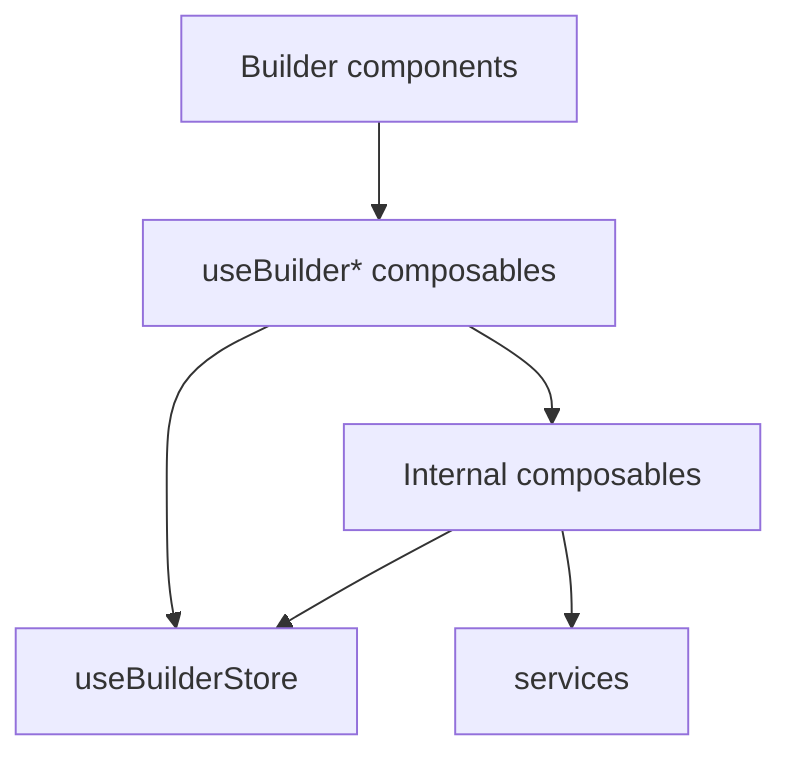

# Composable Architecture

## 역할

`composables`는 Vue/Nuxt 반응형 상태를 사용해 화면 흐름과 사용자 작업을 조립하는 레이어다.

이 프로젝트에서는 `stores`가 여러 화면에서 공유되는 상태의 원천을 맡고, `composables`는 그 상태를 사용해 파일 분석, AI HTML 생성, 화면 이동 guard, 레이아웃 캔버스 조작 같은 기능 흐름을 수행한다.

## 현재 구조

```txt
composables
├─ view
│  └─ useBuilderView.ts
├─ upload
│  └─ useBuilderUpload.ts
├─ file
│  ├─ useBuilderFileAnalysis.ts
│  └─ useFileAnalysis.ts
├─ html
│  └─ useBuilderHtmlGeneration.ts
├─ layout
│  ├─ useBuilderLayoutCanvas.ts
│  └─ useBuilderLayoutDesignToHtml.ts
├─ editor
│  └─ useBuilderEditor.ts
└─ navigation
   └─ useBuilderNavigationGuard.ts
```

## 명명 규칙

컴포넌트에서 직접 사용하는 공개 composable은 `useBuilder*` 이름을 사용한다.

`useBuilder*`가 아닌 하위 composable은 같은 관심사 디렉터리 내부 구현으로 본다. 내부 composable은 store와 service를 조합해 실제 작업을 수행하고, 컴포넌트에서는 직접 호출하지 않는다.

## 기준

composable에 두기 좋은 로직:

- 여러 상태를 함께 읽거나 변경하는 사용자 작업 흐름
- API 요청, 취소, loading/error 상태 전환이 함께 필요한 기능
- 컴포넌트보다 큰 단위지만 순수 service로 분리하기에는 Vue 반응형 상태와 가까운 로직
- 특정 화면에서 재사용되거나 화면 흐름 전체에서 공유되어야 하는 기능

composable에 두지 않는 로직:

- 입력값만 받아 결과를 반환하는 순수 변환 로직
- 서버에서만 실행되어야 하는 API key 기반 처리
- 하나의 컴포넌트 안에서만 끝나는 단순 표시 상태

## 흐름



## store와의 관계

`stores`는 공유 상태를 보관하고, `composables`는 그 상태를 이용해 작업 흐름을 실행한다.

```txt
stores = 상태의 원천
useBuilder* composables = 컴포넌트용 공개 API
internal composables = 관심사별 작업 구현
services = 순수 처리 로직 또는 외부 연동 로직
```

공개 composable끼리 직접 의존하지 않고, 공유가 필요한 상태는 store를 기준으로 연결한다.
