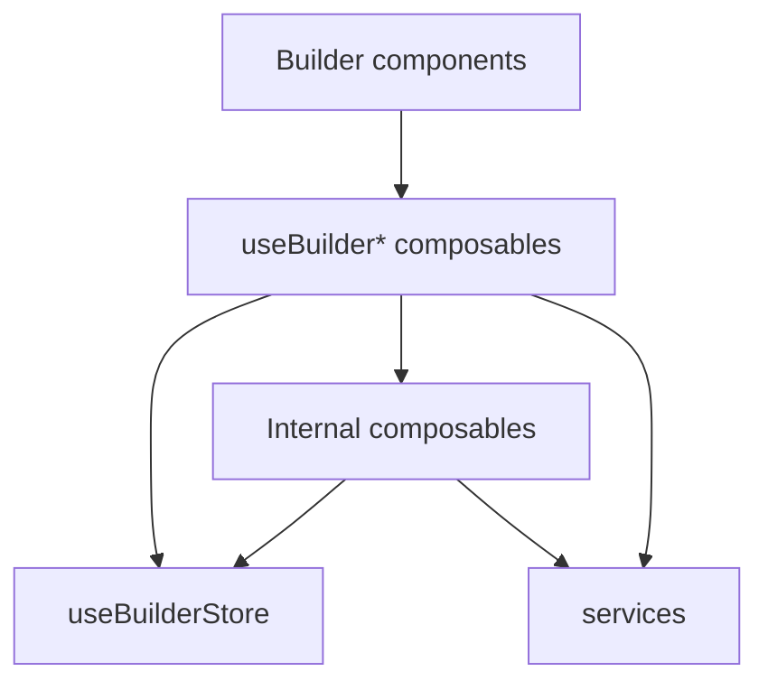

# Composable Architecture

## 역할

`composables`는 Vue/Nuxt 반응형 상태를 사용해 빌더 화면의 사용자 작업, 화면 이동 정책, 요청 취소, 레이아웃 캔버스 상태 같은 기능을 다루는 계층이다.

현재 구조는 단일 controller/facade를 두지 않고, 컴포넌트가 필요한 관심사별 `useBuilder*` composable을 직접 호출한다.

## 현재 구조

```txt
composables
├─ view
│  └─ useBuilderView.ts
├─ upload
│  └─ useBuilderUpload.ts
├─ file
│  ├─ useBuilderFileAnalysis.ts
│  └─ useFileAnalysis.ts
├─ html
│  └─ useBuilderHtmlGeneration.ts
├─ layout
│  ├─ useBuilderLayoutCanvas.ts
│  └─ useBuilderLayoutDesignToHtml.ts
├─ editor
│  └─ useBuilderEditor.ts
└─ navigation
   └─ useBuilderNavigationGuard.ts
```

## 공개 composable

컴포넌트에서 직접 호출하는 composable은 `useBuilder*` 이름을 사용한다.

- `view/useBuilderView.ts`: 현재 view, viewport, guard가 적용된 화면 이동 API
- `upload/useBuilderUpload.ts`: 업로드 파일, 업로드 상태, 업로드 조작 API
- `file/useBuilderFileAnalysis.ts`: 업로드 파일 분석 시작 API
- `html/useBuilderHtmlGeneration.ts`: 이미지/PDF 기반 HTML 생성과 생성 요청 취소 API
- `layout/useBuilderLayoutCanvas.ts`: 레이아웃 블록 상태와 캔버스 조작 API
- `layout/useBuilderLayoutDesignToHtml.ts`: 레이아웃 블록 기반 HTML 생성 API
- `editor/useBuilderEditor.ts`: HTML 편집 문서, 선택 요소, dirty 상태와 문서 수정 API
- `navigation/useBuilderNavigationGuard.ts`: 생성 중 화면 이탈 guard와 guarded action API

## 내부 composable

`useBuilder*`가 아닌 composable은 같은 관심사 디렉터리 내부 구현으로 본다.

현재는 `file/useFileAnalysis.ts`가 HTML 파일 파싱과 파일 유형별 화면 전환 처리를 담당한다. 컴포넌트는 이 파일을 직접 호출하지 않고 `file/useBuilderFileAnalysis.ts`를 사용한다.

## 기준

composable에 두기 좋은 로직:

- 여러 상태를 함께 읽거나 변경하는 사용자 작업 흐름
- API 요청, 취소, loading/error 상태 전환이 함께 필요한 기능
- 화면 이동 전 확인, 파일 분석, HTML 생성, 편집기 반영처럼 컴포넌트보다 큰 단위의 interaction
- Vue 반응형 상태와 가까운 로직이지만 순수 service로 분리하기에는 앱 흐름에 의존하는 코드

composable에 두지 않는 로직:

- 입력값만 받아 결과를 반환하는 순수 변환 로직
- 서버에서만 실행되어야 하는 API key 기반 처리
- 하나의 컴포넌트 안에서만 끝나는 단순 표시 상태

## 흐름



## store와의 관계

`stores`는 공유 상태를 보관하고, `composables`는 그 상태를 이용해 작업 흐름을 실행한다.

```txt
stores = 공유 상태와 단순 상태 변경
useBuilder* composables = 컴포넌트에서 사용하는 관심사별 API
internal composables = 공개 composable 뒤의 세부 작업 구현
services = 순수 처리 로직 또는 외부 연동 보조 로직
```

공유가 필요한 상태는 store를 기준으로 연결한다. 다만 `AbortController`나 레이아웃 캔버스처럼 런타임 객체 또는 화면 작업 모델에 가까운 상태는 composable 내부에서 Nuxt app 인스턴스 기준으로 공유할 수 있다.
