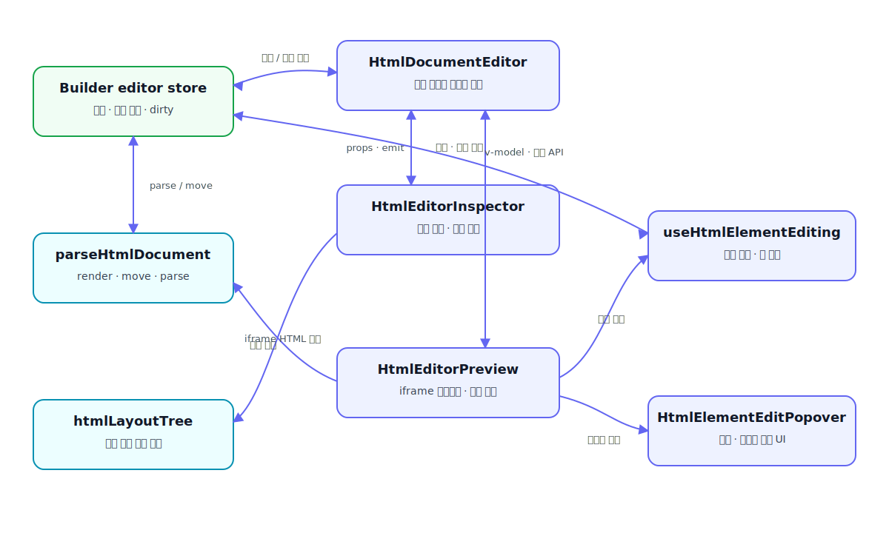
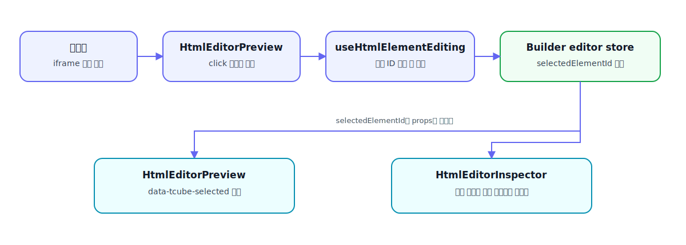
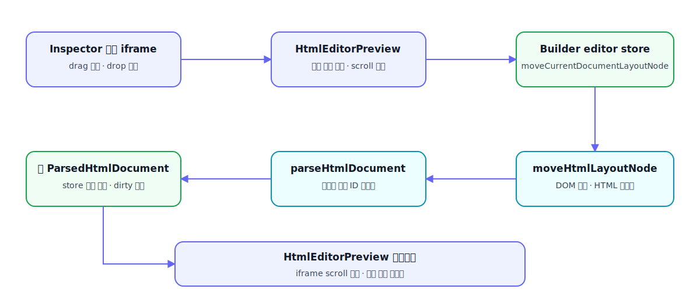

# HTMLDocumentEditor 구조와 동작 프로세스

## 1. 목적

이 문서는 `HtmlDocumentEditor.vue`를 중심으로 HTML 편집 화면의 파일 구조, 상태 소유권, 컴포넌트 통신, iframe 편집 및 구조 이동 프로세스를 설명한다.

HTML 문자열이 편집 가능한 문서 모델로 변환되는 이전 단계는 `docs/analyze/03-html-editable-elements.md`를 참고한다. 이 문서는 `ParsedHtmlDocument`가 store에 저장된 이후부터 사용자가 요소를 선택하고 수정하거나 HTML 구조를 이동하는 과정에 집중한다.

## 2. 전체 구조

```txt
HtmlDocumentEditor.vue
├─ HtmlEditorInspector.vue
│  ├─ 요소 탭 목록
│  └─ 구조 탭 트리와 drag & drop
└─ HtmlEditorPreview.vue
   ├─ iframe 미리보기
   ├─ useHtmlElementEditing.ts
   └─ HtmlElementEditPopover.vue

공유 상태
└─ useBuilderEditor.ts
   └─ stores/builder/editor.ts

HTML 처리
├─ services/html/parseHtmlDocument.ts
└─ services/html/htmlLayoutTree.ts

공통 타입과 스타일
├─ types/builder/html-document-editor.ts
└─ assets/styles/html-document-editor.css
```

컴포넌트 간 관계는 다음과 같다.



## 3. 파일별 책임

### 3.1 `HtmlDocumentEditor.vue`

HTML 편집 화면의 진입점이자 Inspector와 Preview 사이의 조정자다.

주요 책임:

- `useBuilderEditor()`에서 현재 문서와 선택 요소 상태 조회
- `useBuilderView()`의 viewport에 따라 iframe 너비 계산
- Inspector 표시 여부와 활성 탭 관리
- 요소, 구조, drag, hover 이벤트를 Inspector와 Preview 사이에서 전달
- 편집할 문서가 없을 때 placeholder 표시

이 파일은 iframe DOM을 직접 조작하지 않는다. Preview의 `defineExpose()` API를 호출해 실제 포커스와 구조 이동을 요청한다.

Preview 공개 API:

```ts
type HtmlEditorPreviewExposed = {
  focusEditableElement: (element: ParsedHtmlEditableElement) => void
  focusLayoutNode: (layoutNode: ParsedHtmlLayoutNode) => void
  moveDraggedLayoutNode: (targetNodeId: string, position: 'before' | 'after') => void
}
```

### 3.2 `HtmlEditorInspector.vue`

좌측 요소 탭과 구조 탭의 표시 및 목록 상호작용을 담당한다.

요소 탭 책임:

- `document.elements` 목록 출력
- 선택 요소 active 표시
- 요소 click/hover 이벤트 전달
- 선택 요소가 변경되면 활성 항목을 목록 중앙으로 스크롤

구조 탭 책임:

- `document.layoutNodes`를 계층형 목록으로 표시
- 노드별 접기 및 전체 접기 상태 관리
- 선택 노드의 조상, 부모, 하위 범위 강조
- 같은 부모를 가진 노드 사이의 drag & drop 요청 전달
- 선택 구조가 접힌 노드 안에 있으면 조상 노드 자동 펼침

구조 계산 자체는 `services/html/htmlLayoutTree.ts`에 위임한다. Inspector에는 Vue 반응성과 UI 이벤트 처리만 남긴다.

### 3.3 `HtmlEditorPreview.vue`

iframe 미리보기의 수명주기와 구조 편집을 담당한다.

주요 책임:

- `renderEditableHtmlDocument()`로 iframe `srcdoc` 생성
- iframe load 이후 클릭, hover, scroll, drag 이벤트 연결
- Inspector 모드에 맞춰 요소 또는 구조 선택 처리
- 선택, hover, drag 상태를 iframe의 `data-tcube-*` 속성으로 동기화
- 구조 노드 선택 시 iframe 위치 이동
- 구조 노드 drag & drop 가능 범위와 앞/뒤 위치 계산
- iframe이 다시 렌더링될 때 기존 스크롤 위치 복원
- `useHtmlElementEditing()`과 `HtmlElementEditPopover` 연결

iframe에는 다음 sandbox 권한만 부여한다.

```html
sandbox="allow-same-origin allow-popups allow-forms"
```

스크립트 실행 권한은 없지만, 부모 편집기가 `contentDocument`에 접근해 이벤트와 편집 상태를 연결할 수 있도록 `allow-same-origin`을 사용한다.

### 3.4 `HtmlElementEditPopover.vue`

링크와 미디어 편집 팝오버의 표시 전용 컴포넌트다.

주요 화면 모드:

- `menu`: 가능한 편집 작업 선택
- `href`: 링크 주소 입력
- `media-src`: 이미지, picture, video source URL 또는 파일 입력

이 컴포넌트는 store나 iframe을 직접 변경하지 않는다. 입력값과 사용자 요청을 emit하고, 실제 변경은 `useHtmlElementEditing()`이 처리한다.

### 3.5 `useHtmlElementEditing.ts`

요소 모드에서 발생하는 편집 동작을 조합하는 composable이다.

주요 책임:

- iframe 편집 요소 선택
- 텍스트 `contenteditable` 편집 시작과 종료
- 링크 주소 편집
- 이미지, picture, video source 편집
- 로컬 파일을 data URL로 읽어 미디어에 반영
- 팝오버 상태와 좌표 계산
- 선택 요소를 iframe 중앙으로 이동
- 변경 값을 `useBuilderEditor()`를 통해 store에 반영

특정 컴포넌트의 단순 표시 상태가 아니라 iframe DOM, Vue 반응성, store 변경을 함께 조합하는 작업이므로 composable에 위치한다.

### 3.6 `services/html/parseHtmlDocument.ts`

HTML 문서 모델의 생성, 렌더링, 구조 이동을 담당한다.

이 편집 화면에서 사용하는 주요 API:

- `parseHtmlDocument()`: HTML 문자열을 `ParsedHtmlDocument`로 변환
- `renderEditableHtmlDocument()`: 현재 편집값과 `data-tcube-*` 속성이 반영된 iframe HTML 생성
- `renderFinalHtmlDocument()`: 에디터 전용 상태를 제외한 최종 HTML 생성
- `moveHtmlLayoutNode()`: 같은 부모 아래의 구조 노드를 앞이나 뒤로 이동

### 3.7 `services/html/htmlLayoutTree.ts`

DOM이나 Vue 반응성에 의존하지 않는 구조 트리 계산을 담당한다.

주요 계산:

- 접힌 조상이 없는 노드 목록
- 선택 노드의 계층과 활성 영역
- 최상위 구조 범위
- 접기 가능한 노드와 하위 접기 가능 노드
- 특정 노드의 하위 구조 여부

### 3.8 타입과 스타일

`types/builder/html-document-editor.ts`:

- Inspector 모드
- 구조 이동 위치
- 편집 팝오버 모드와 상태

`assets/styles/html-document-editor.css`:

- 편집 화면 grid 크기
- Inspector와 Preview의 높이 및 overflow
- 요소 목록과 구조 트리
- iframe 미리보기
- 선택, hover, drag, 팝오버 표현
- 반응형 레이아웃

## 4. 핵심 데이터 모델

```ts
type ParsedHtmlDocument = {
  id: string
  title: string
  sourceName: string
  rawHtml: string
  elements: ParsedHtmlEditableElement[]
  layoutNodes: ParsedHtmlLayoutNode[]
}
```

`elements`와 `layoutNodes`는 같은 HTML을 서로 다른 관점으로 표현한다.

| 구분 | 목적 | 선택 기준 | 주요 작업 |
| --- | --- | --- | --- |
| `elements` | 사용자가 수정할 수 있는 콘텐츠 | `data-tcube-editable-id` | 텍스트, 링크, 이미지, 미디어 수정 |
| `layoutNodes` | HTML 구조와 배치 | `data-tcube-layout-id` | 구조 선택, 계층 표시, 형제 순서 이동 |

편집 요소의 `selector`와 구조 노드의 `selector`는 `rawHtml`에서 대응 DOM을 다시 찾는 연결 키다. 화면 선택에는 재파싱 후 달라질 수 있는 selector보다 `id`를 사용한다.

## 5. 상태 소유권

| 상태 | 소유 위치 | 이유 |
| --- | --- | --- |
| `currentDocument` | builder editor store | Inspector, Preview, 저장 과정이 공유하는 문서 원본 |
| `selectedElementId` | builder editor store | 요소 목록과 iframe이 공유하는 선택 상태 |
| `dirty` | builder editor store | 화면 이동 및 저장 과정에서 사용하는 변경 여부 |
| `showElementList` | `HtmlDocumentEditor.vue` | 현재 편집 화면 안에서만 사용하는 패널 표시 상태 |
| `inspectorMode` | `HtmlDocumentEditor.vue` | Inspector와 Preview가 공유하는 현재 탭 |
| `selectedLayoutNodeId` | 부모와 Preview의 `v-model` | 구조 목록과 iframe 구조 선택 동기화 |
| `draggedLayoutNodeId` | 부모와 Preview의 `v-model` | Inspector drag와 iframe drag 상태 동기화 |
| hover 대상 ID | `HtmlDocumentEditor.vue` | Inspector hover를 Preview로 전달하는 일시 상태 |
| 접힌 구조 노드 ID | `HtmlEditorInspector.vue` | 구조 목록에서만 사용하는 표시 상태 |
| 팝오버와 임시 미디어 상태 | `useHtmlElementEditing.ts` | 요소 편집 작업 동안만 필요한 임시 상태 |
| iframe DOM 참조와 pending scroll | `HtmlEditorPreview.vue` | iframe 렌더링 수명주기와 직접 연결된 상태 |

문서 데이터와 저장에 영향을 주는 상태는 store에 두고, 한 화면 또는 한 컴포넌트에서만 끝나는 UI 상태는 로컬에 둔다.

## 6. 초기 렌더링 프로세스

```txt
builder editor store.currentDocument 변경
→ HtmlDocumentEditor.currentDocument computed 갱신
→ Inspector에 ParsedHtmlDocument 전달
→ Preview.previewHtml computed 재계산
→ renderEditableHtmlDocument(currentDocument)
→ iframe srcdoc 교체
→ iframe load
→ handlePreviewLoad()
→ 이벤트 연결 및 mode/selection/scroll 상태 복원
```

`renderEditableHtmlDocument()`는 iframe 문서에 편집용 속성을 추가한다.

- `data-tcube-editable-id`
- `data-tcube-editable-type`
- `data-tcube-layout-id`

Preview는 이 속성을 사용해 사용자가 클릭하거나 hover한 DOM을 문서 모델의 요소 또는 구조 노드로 연결한다.

## 7. 요소 모드 프로세스

### 7.1 iframe에서 요소 선택



요소 유형에 따른 후속 동작:

- 일반 텍스트: `contenteditable` 편집 시작
- 링크: 링크 또는 텍스트 편집 메뉴 표시
- 이미지: 이미지 및 연결 링크 편집 메뉴 표시
- picture/video: source 목록 편집 메뉴 표시

### 7.2 요소 목록에서 선택

```txt
Inspector 항목 click
→ select-element emit
→ HtmlDocumentEditor.handleElementListClick()
→ Preview.focusEditableElement()
→ 대응 iframe 요소 조회
→ iframe 요소를 화면 중앙으로 스크롤
→ 요소 선택 및 유형별 편집 UI 표시
```

부모는 Preview 내부 구현을 알지 않고 공개된 `focusEditableElement()`만 호출한다.

### 7.3 요소 값 변경

```txt
텍스트, href 또는 media source 변경
→ useHtmlElementEditing
→ iframe DOM에 즉시 반영
→ builderEditor.updateCurrentDocumentElement()
→ store.currentDocument.elements 갱신
→ dirty = true
→ previewHtml 재계산
→ iframe srcdoc 재렌더링
```

iframe DOM 선반영은 입력 결과를 즉시 보여주기 위한 처리다. 영속적인 변경 기준은 store의 `currentDocument`다.

## 8. 구조 모드 프로세스

### 8.1 모드 전환

요소 탭에서 구조 탭으로 전환하면 다음 상태를 정리한다.

- 요소 편집 팝오버 닫기
- store의 요소 선택 해제
- iframe 구조 요소의 `draggable` 상태 활성화
- 구조 선택과 hover 강조 사용

다시 요소 탭으로 전환하면 구조 선택과 drag 강조를 제거하고 요소 선택 방식을 사용한다.

### 8.2 구조 선택

Inspector에서 구조 선택:

```txt
구조 항목 click
→ HtmlDocumentEditor.handleLayoutNodeClick()
→ Preview.focusLayoutNode()
→ selectedLayoutNodeId 갱신
→ iframe data-tcube-layout-selected 갱신
→ 선택 구조를 iframe 세로 중앙으로 스크롤
```

iframe에서 구조 선택:

```txt
iframe click capture
→ handlePreviewLayoutClick()
→ resolvePreviewLayoutElement()
→ selectedLayoutNodeId 갱신
→ v-model로 부모와 Inspector에 전달
→ Inspector가 접힌 조상을 펼침
→ 활성 구조 항목을 목록 중앙으로 스크롤
```

`resolvePreviewLayoutElement()`는 링크 내부 구조를 보정하고, 자식이 하나뿐인 단순 wrapper에서는 실제 이동에 적합한 상위 구조까지 선택 대상을 올릴 수 있다.

### 8.3 구조 drag & drop

구조 이동은 다음 조건에서만 허용한다.

- source와 target이 서로 다른 노드
- 두 노드의 `parentSelector`가 동일
- source와 target DOM의 실제 부모가 동일
- source와 target이 서로의 하위 노드가 아님

전체 흐름:



구조를 이동한 뒤 전체 문서를 다시 파싱하는 이유는 DOM 순서 변경으로 selector, 요소 ID, 구조 ID가 달라질 수 있기 때문이다.

## 9. iframe 재렌더링과 스크롤 보존

`previewHtml`이 변경되면 iframe `srcdoc`이 교체되므로 기존 iframe DOM과 이벤트는 사라진다. 따라서 `handlePreviewLoad()`에서 이벤트와 선택 상태를 매번 다시 연결한다.

구조 이동처럼 현재 위치를 유지해야 하는 작업은 다음 순서를 사용한다.

1. `getPreviewScrollPosition()`으로 현재 좌표 저장
2. store 문서 변경
3. iframe 재렌더링
4. `restorePendingPreviewScrollPosition()` 실행
5. 두 번의 `requestAnimationFrame()` 뒤 scroll 복원

요소나 구조를 명시적으로 선택한 경우에는 대상 요소의 중앙 위치로 스크롤한다. 문서 재렌더링 복원과 사용자 선택 스크롤은 목적이 다르므로 별도 함수로 유지한다.

## 10. 선택과 강조에 사용하는 data 속성

| 속성 | 용도 |
| --- | --- |
| `data-tcube-editable-id` | iframe DOM과 `ParsedHtmlEditableElement` 연결 |
| `data-tcube-editable-type` | 텍스트, 링크, 이미지, 미디어 유형 구분 |
| `data-tcube-layout-id` | iframe DOM과 `ParsedHtmlLayoutNode` 연결 |
| `data-tcube-selected` | 요소 모드 선택 강조 |
| `data-tcube-layout-selected` | 구조 모드 선택 강조 |
| `data-tcube-hovered` | Inspector 또는 iframe hover 강조 |
| `data-tcube-layout-dragging` | 이동 중인 구조 강조 |
| `data-tcube-layout-drop-allowed` | drop 가능한 형제 범위 표시 |
| `data-tcube-layout-drop-position` | target 앞 또는 뒤 drop 위치 표시 |
| `data-tcube-layout-drop-axis` | 가로 또는 세로 drop 표시 축 |

이 속성들은 편집 화면용 상태다. 최종 HTML 생성에서는 에디터 전용 상태가 제거되어야 한다.

## 11. 크기와 스크롤 구조

화면은 바깥 문서 전체가 아니라 각 작업 영역이 독립적으로 스크롤하도록 구성한다.

```txt
.html-editor-screen
└─ .html-editor-layout
   ├─ .html-editor-panel
   │  └─ .html-inspector-list      → 요소/구조 목록 세로 스크롤
   └─ .html-editor-preview
      └─ .html-browser-preview
         └─ .html-browser-frame    → iframe body 자체 스크롤
```

이 구조에서는 부모 grid/flex 항목의 `min-height: 0`과 고정된 높이 연결이 중요하다. 상위 높이 규칙이 끊기면 Inspector 목록은 콘텐츠 높이만큼 늘어나 스크롤을 잃고, iframe도 남은 높이를 계산하지 못한다.

레이아웃 스타일을 수정할 때 확인할 항목:

- `.html-editor-screen`의 높이와 grid 적용 여부
- `.html-editor-layout`의 `minmax(0, 1fr)` 열
- `.html-editor-panel`과 `.html-editor-preview`의 overflow
- `.html-inspector-list`의 `min-height: 0`과 `overflow-y: auto`
- `.html-browser-preview`와 `.html-browser-frame`의 높이 연결
- Inspector 표시/숨김 전후 Preview 너비와 높이

## 12. 기능 추가 기준

### 컴포넌트에 둘 내용

- 템플릿 표시
- props와 emit 연결
- DOM 이벤트와 특정 화면의 일시 상태
- iframe 수명주기에 직접 연결된 처리

### composable에 둘 내용

- iframe DOM, Vue 반응성, store 변경을 함께 조합하는 사용자 작업
- 여러 편집 UI가 공유하는 임시 상태와 편집 프로세스
- 단순 전달이 아닌 실제 조합 책임이 있는 기능

### store에 둘 내용

- 저장 결과에 영향을 주는 문서 상태
- 여러 컴포넌트가 공유하는 선택 상태
- dirty 상태와 문서 변경 API

### service에 둘 내용

- Vue 상태 없이 입력과 출력으로 설명 가능한 HTML 처리
- 구조 트리 계층 계산
- HTML 파싱, 직렬화, DOM 순서 이동

단순히 다른 함수를 한 번 호출하는 wrapper는 추가하지 않는다. 새 facade나 composable은 둘 이상의 상태 또는 작업을 실제로 조합할 때만 만든다.

## 13. 변경 시 검증 체크리스트

- 요소 탭에서 iframe 요소 클릭 시 대응 항목이 목록 중앙에 표시되는가
- 요소 목록 클릭 시 iframe의 대응 요소가 선택되고 중앙에 표시되는가
- 구조 탭에서 접힌 노드 안의 항목을 선택하면 조상이 펼쳐지는가
- 구조 목록과 iframe 양쪽에서 선택 강조가 동기화되는가
- drag & drop이 같은 부모의 형제 사이에서만 동작하는가
- 구조 이동 뒤 선택 대상과 iframe scroll이 유지되는가
- 텍스트, href, 이미지와 media source 변경이 store에 반영되는가
- 변경 후 `dirty`가 설정되는가
- iframe 재렌더링 뒤 클릭, hover, drag 이벤트가 계속 동작하는가
- Inspector를 숨기고 다시 열어도 Preview 크기와 스크롤이 유지되는가
- PC, Tablet, Mobile viewport 너비가 정상 적용되는가
- `pnpm build`가 통과하는가

## 14. 관련 문서

- `docs/analyze/03-html-editable-elements.md`: HTML 입력에서 편집 가능 요소를 추출하는 과정
- `docs/analyze/02-builder-result-delivery.md`: 편집 결과 전달과 저장 흐름
- `docs/architecture.md`: 프로젝트 전체 계층과 디렉터리 책임
